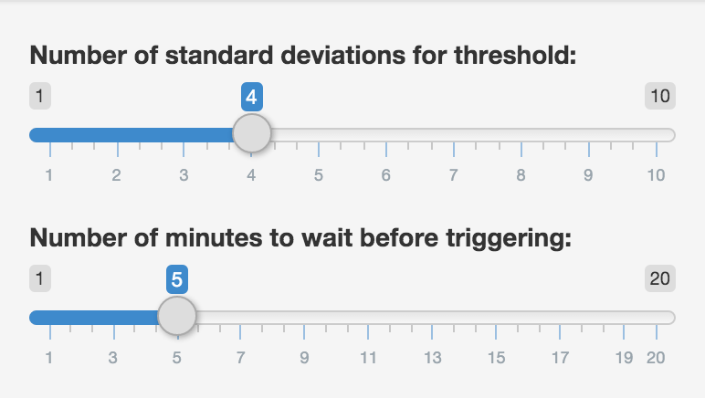

```{r init, echo=F, message=F, warning=F, error=T}
library(ggplot2)
library(lubridate)
library(knitr)

opts_chunk$set(cache=F, echo=F)
source('eval.R')
signal <- readRDS('signal.rds')
baseline <- readRDS('baseline.rds')
```
## Is My Application Healthy?
You're using the Basil Application Performance Management Tool to watch your web
application and page you when pages slow down or throughput spikes.  Basil uses historical data to build a baseline for expected performance and pages you when it detects an anomaly based on the following parameters:

* The number of standard deviations $\sigma$ from the baseline that represent a violation.
* The number of minutes of consecutive violations (lead time) required to flag an anomaly and send you a page.

How do you tune these parameters so you get notified when things are bad but don't get woken up for a non-emergency?

----
## Tuning Basil

Knowing how to set the parameters will be tricky so I've built an application
that let's you see what alerts would be generated on a sample dataset for 
any given parameters.  

The tool will show you a plot of real time page response time averages over a
six hour period along with the baseline used to determine when response times
are excessively slow.  

Based on the settings you will see areas highlighted in red where an alert 
would be triggered given the parameters you set.

----
## Small $\sigma$ Multiple, Big Lead Time

```{r}
lt <- 6
ns <- 3
r <- threshold_eval(signal,
                    lead_time=lt,
                    num_sigmas = ns)  
```
With a lead time of `r lt` minutes using `r ns` $\sigma$, you can see in the sample data the gray area at $baseline+/-3\sigma$ where alerts will get triggered.  With these parameters you get poor selectivity--there are too many alerts.

```{r, fig.height=5, fig.width=12}
ggplot(r) + aes(x=start, y=value) + 
    geom_line() +
    facet_grid(name ~ .,scales = 'free_y') +
    geom_step(aes(y=baseline), color='#669900') +
    geom_rect(aes(xmin=start, xmax=start+minutes(1), alpha=trigger, 
                  ymax=value, ymin=baseline, fill=trigger), alpha=0.2) +
    scale_fill_manual(values=c('#FFEEFF', '#FF3333', '#CCCC00')) +
    scale_alpha_manual(values=c(0, .4, .4)) +
    geom_ribbon(aes(ymax=baseline+threshold, ymin=baseline-threshold), color='#CCCCCC', alpha=0.2) +
    theme_bw()
```

---
## Big $\sigma$ Multiple, Small Lead Time

```{r}
lt <- 1
ns <- 6
r <- threshold_eval(signal,
                    lead_time=lt,
                    num_sigmas=ns)  
```
With a lead time of `r lt` minutes using `r ns` $\sigma$, you get fewer alerts but they also clear too quickly--they are too narrow.

```{r, fig.height=5, fig.width=12}
ggplot(r) + aes(x=start, y=value) + 
    geom_line() +
    facet_grid(name ~ .,scales = 'free_y') +
    geom_step(aes(y=baseline), color='#669900') +
    geom_rect(aes(xmin=start, xmax=start+minutes(1), alpha=trigger, 
                  ymax=value, ymin=baseline, fill=trigger), alpha=0.2) +
    scale_fill_manual(values=c('#FFEEFF', '#FF3333', '#CCCC00')) +
    scale_alpha_manual(values=c(0, .4, .4)) +
    geom_ribbon(aes(ymax=baseline+threshold, ymin=baseline-threshold), color='#CCCCCC', alpha=0.2) +
    theme_bw()
```

----
## Interactive Tuning

The ideal parameters depend on the underlying data and your prefererred tradeoffs for 
sensitivity and selectivity.  Using the Basil Parameter Tuning application you can adjust 
parameters and examine the alerts that would be triggered until you are satisfied the algorithm
meets your needs.



